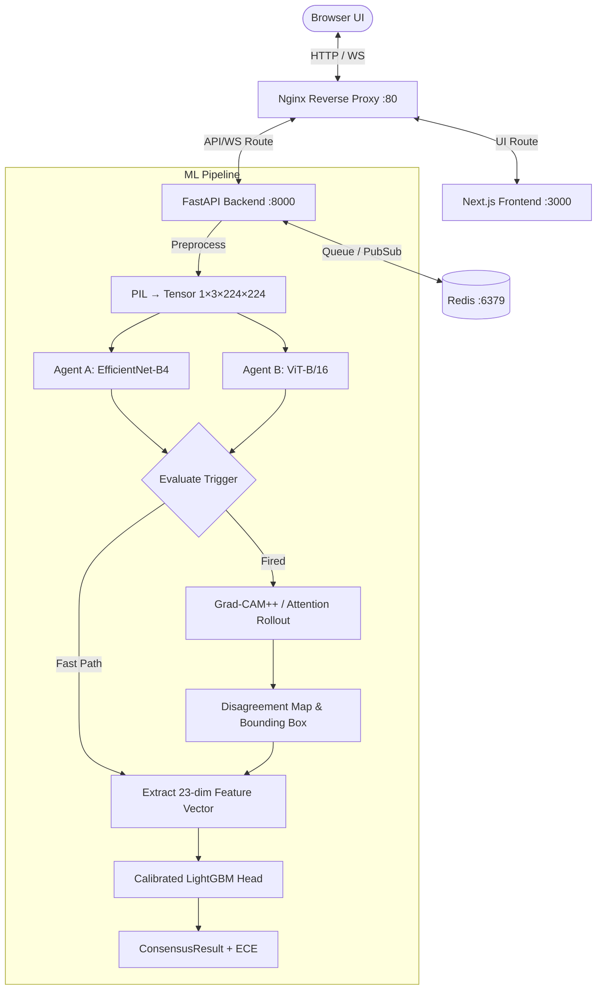

<div align="center">

  

  # Argus Vision

  **Adversarial multi-agent visual debate for uncertainty-aware dermoscopic image classification**

  [](https://python.org)
  [](https://pytorch.org)
  [](https://nextjs.org)
  [](https://fastapi.tiangolo.com)
  [](https://lightgbm.readthedocs.io)
  [](https://docker.com)
  [](https://redis.io)
  [](#license)

  <br>

  <sub>Researched & Developed by <b>Ahmad Hassan</b></sub>

</div>

<br>

> **Medical vision classifiers are often overconfident near decision boundaries.** Argus Vision solves this by deploying two independent neural agents — a **CNN (EfficientNet-B4)** and a **Vision Transformer (ViT-B/16)** — that analyze the same dermoscopic image independently, trigger a spatial attention debate when they disagree, and converge through a **calibrated LightGBM consensus head** on a verdict neither could reach alone.

<br>

## 🎬 Live Demo

<div align="center">

https://github.com/user-attachments/assets/video.mp4

<video src="frontend/public/video.mp4" autoplay loop muted playsinline width="100%"></video>

<sub>Full inference pipeline — from lesion upload through dual-agent classification, spatial attention heatmaps, adversarial debate, to calibrated consensus verdict.</sub>

</div>

<br>

---

## ✨ Highlights

<table>
<tr>
<td width="50%">

### 🧠 Dual-Agent Architecture
Two state-of-the-art vision backbones evaluate every lesion independently — **EfficientNet-B4** (CNN) and **ViT-B/16** (Transformer) — trained on the ISIC 2019 dataset across 8 diagnostic categories.

</td>
<td width="50%">

### ⚡ Intelligent Debate Trigger
Monitors **Jensen-Shannon divergence** and **Shannon entropy** in real-time. When agents disagree beyond threshold ($D_{JS} > 0.25$ or $H > 0.8$ bits), spatial attention analysis fires automatically.

</td>
</tr>
<tr>
<td>

### 🔬 Spatial Evidence Mapping
**Grad-CAM++** (CNN) and **Attention Rollout** (ViT) generate saliency heatmaps. A disagreement map highlights exactly where the two agents conflict spatially, with bounding-box localization.

</td>
<td>

### 🎯 Calibrated Consensus
A **23-dimensional numerical feature vector** feeds into a LightGBM fusion head trained with 5-Fold Stratified CV and Isotonic calibration — delivering temperature-scaled, ECE-reported verdicts.

</td>
</tr>
<tr>
<td>

### 🏥 Clinical-Grade Interface
DICOM workstation-inspired UI with real-time WebSocket streaming, 4-quadrant image viewer, live probability bars, and a diagnostic report sidebar that reads like hospital-grade equipment.

</td>
<td>

### 🐳 One-Command Deployment
Fully containerized with Docker Compose — Next.js frontend, FastAPI backend, Redis job queue, and Nginx reverse proxy. From `git clone` to live in one command.

</td>
</tr>
</table>

---

## 🏗️ System Architecture



---

## 🧬 The 23-Dimensional Consensus Contract

The calibrated fusion head consumes a fixed-width numerical feature vector — no text, no embeddings, no LLM calls:

| Index | Feature | Description |
|:------|:--------|:------------|
| 0–7 | `pA[0..7]` | Agent A softmax probabilities over 8 ISIC classes |
| 8–15 | `pB[0..7]` | Agent B softmax probabilities over 8 ISIC classes |
| 16 | `js_div` | Jensen-Shannon divergence between pA and pB |
| 17 | `entropy_a` | Shannon entropy of pA (bits) |
| 18 | `entropy_b` | Shannon entropy of pB (bits) |
| 19 | `max_prob_delta` | max\|pA − pB\| across 8 classes |
| 20 | `attn_iou` | IoU of thresholded attention maps |
| 21 | `attn_entropy_a` | Spatial entropy of Agent A's attention map |
| 22 | `attn_entropy_b` | Spatial entropy of Agent B's attention map |

> Features 20–22 are `0.0` on the fast path (agents agree). When the debate trigger fires, Grad-CAM++ and Attention Rollout maps are computed and their statistics populate these indices.

---

## 🗂️ ISIC Diagnostic Categories

The pipeline classifies into the **8 canonical ISIC 2019 categories**:

| Code | Diagnosis | Clinical Summary |
|:-----|:----------|:-----------------|
| **MEL** | Melanoma | Atypical pigment network, irregular streaks, blue-white veil |
| **NV** | Melanocytic Nevus | Symmetric reticular/globular pattern, uniform color |
| **BCC** | Basal Cell Carcinoma | Arborising vessels, blue-grey ovoid nests |
| **AK** | Actinic Keratosis | Strawberry pattern, red pseudo-network, white rosettes |
| **BKL** | Benign Keratosis | Cerebriform surface, milia-like cysts, comedo openings |
| **DF** | Dermatofibroma | Central white scar-like patch, peripheral pigment network |
| **VASC** | Vascular Lesion | Red/purple lacunae, no melanocytic network |
| **SCC** | Squamous Cell Carcinoma | Central keratin, surface ulceration, looped vessels |

---

## 🚀 Quick Start

### Prerequisites

- **Docker Engine** with Compose plugin v2.24+
- Internet connection (first run downloads ~1 GB of pretrained weights)

### Launch

```bash
git clone https://github.com/your-username/argus-vision.git
cd argus-vision
docker compose up --build
```

Open **`http://localhost`** in your browser. That's it.

> **First run:** Downloads model weights and caches them in a Docker volume. Subsequent launches are near-instant.

---

## 🧪 Training Pipeline

All models are trainable on a **free Kaggle GPU** using the provided notebooks:

| Step | Notebook | Produces |
|:-----|:---------|:---------|
| 1 | `01_train_agent_a.ipynb` | `agent_a_best.pth` — EfficientNet-B4 classifier |
| 2 | `02_train_agent_b.ipynb` | `agent_b_best.pth` — ViT-B/16 classifier |
| 3 | `03_build_hard_subset.ipynb` | `hard_subset.csv` — disagreement boundary cases |
| 4 | `04_train_consensus.ipynb` | `consensus_best.pth` + scaler — LightGBM fusion head |
| 5 | `05_evaluation.ipynb` | Full evaluation metrics, calibration curves |

**Dataset:** [ISIC 2019](https://www.kaggle.com/datasets/andrewmvd/isic-2019) — 25,331 dermoscopic images across 8 classes.

### Deploying Trained Weights

```bash
# Drop checkpoints into the backend
cp agent_a_best.pth agent_b_best.pth consensus_best.pth backend/checkpoints/
docker compose up --build
```

> Notebooks are **Kaggle-native and self-contained** — they auto-discover datasets, chain outputs between stages, and inline all dependencies. See `ml_training/` for details.

---

## 📂 Repository Structure

```
argus-vision/
├── backend/                    # FastAPI backend
│   ├── api/
│   │   ├── routes/             # REST endpoints (classify, jobs, health)
│   │   └── websocket/          # Real-time debate streaming via Redis pub/sub
│   ├── ml/
│   │   ├── agents/             # EfficientNet-B4 & ViT-B/16 wrappers
│   │   ├── attention/          # Grad-CAM++, Attention Rollout, disagreement maps
│   │   ├── consensus/          # Calibrated LightGBM/MLP fusion classifier
│   │   ├── debate/             # Trigger evaluation & 23-dim feature extraction
│   │   └── pipeline.py         # End-to-end orchestrator
│   ├── services/               # Redis persistence & image preprocessing
│   ├── checkpoints/            # Model weights (.pth, .pkl)
│   └── Dockerfile
│
├── frontend/                   # Next.js 14 application
│   ├── src/
│   │   ├── app/                # Pages (landing, debate viewer)
│   │   ├── components/         # UI components (debate transcript, heatmaps, etc.)
│   │   ├── hooks/              # React hooks (WebSocket, debate engine, countup)
│   │   └── lib/                # Client-side debate engine, constants, utilities
│   └── Dockerfile
│
├── ml_training/                # Kaggle training notebooks (01–05)
│   ├── 01_train_agent_a.ipynb  # Train EfficientNet-B4
│   ├── 02_train_agent_b.ipynb  # Train ViT-B/16
│   ├── 03_build_hard_subset.ipynb
│   ├── 04_train_consensus.ipynb# Train calibrated consensus head
│   └── 05_evaluation.ipynb    # Full evaluation & calibration analysis
│
├── nginx/                      # Reverse proxy configuration
├── docker-compose.yml          # Full-stack orchestration
└── README.md
```

---

## ⚙️ Configuration

### Backend Environment

| Variable | Default | Description |
|:---------|:--------|:------------|
| `REDIS_URL` | `redis://redis:6379` | Redis connection for job queue & pub/sub |
| `MODEL_CHECKPOINT_DIR` | `./checkpoints` | Path to model weight files |
| `DEBATE_JS_THRESHOLD` | `0.25` | JS divergence threshold to trigger debate |
| `DEBATE_ENTROPY_THRESHOLD` | `0.8` | Shannon entropy threshold (bits) |
| `PRETRAINED_FALLBACK` | `True` | Fall back to ImageNet weights if checkpoints missing |
| `MAX_IMAGE_SIZE_MB` | `10` | Maximum upload file size |

### Frontend Environment

| Variable | Default | Description |
|:---------|:--------|:------------|
| `NEXT_PUBLIC_API_URL` | `http://localhost/api` | REST API base URL |
| `NEXT_PUBLIC_WS_URL` | `ws://localhost/ws` | WebSocket endpoint URL |

---

## 🔌 API Reference

### REST

| Endpoint | Method | Description |
|:---------|:-------|:------------|
| `/api/classify` | `POST` | Upload dermoscopic image → returns `job_id` |
| `/api/jobs/{job_id}` | `GET` | Retrieve full job result with predictions |
| `/api/health` | `GET` | Health check and model loading status |

### WebSocket

Connect to `ws://localhost/ws/debate/{job_id}` to receive real-time pipeline events:

| Event Type | Payload |
|:-----------|:--------|
| `agents_running` | Pipeline started |
| `agents_done` | Agent A & B predictions + heatmaps |
| `trigger_evaluated` | JS divergence, entropy, fired status |
| `attention_computed` | Grad-CAM++, Rollout, disagreement map base64 |
| `consensus_done` | Final calibrated prediction + ECE |

---

## 🛡️ Disclaimer

> **This is a research prototype.** Argus Vision is designed for academic and research exploration of multi-agent consensus architectures in medical imaging. It is **not** a certified medical device and must **not** be used for clinical diagnostic decisions. Always consult qualified healthcare professionals for medical diagnoses.

---

## 📄 License

This project is licensed under the **MIT License** — see [LICENSE](LICENSE) for details.

---

<div align="center">

  

  <br>

  <sub>Built with ❤️ by <b>Ahmad Hassan</b></sub>

  <br>

  <sub>Powered by PyTorch · FastAPI · Next.js · LightGBM · Docker</sub>

</div>
