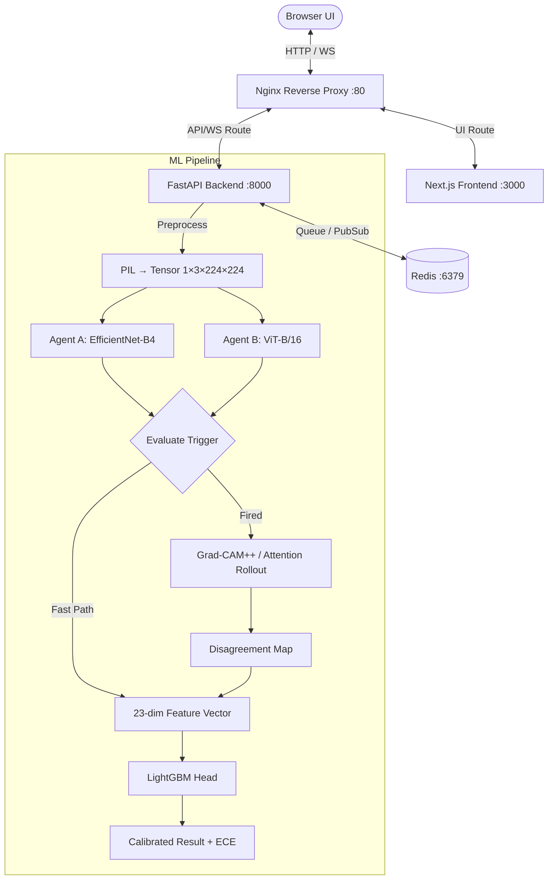

# Argus Vision — Technical Context

> **Authoritative technical reference for the Argus Vision codebase.**
> This document provides architecture, pipeline mechanics, API contracts, and configuration details for developers and AI agents working on this project.

---

## 1. Project Overview

**Argus Vision** is a medical image classification platform that diagnoses dermoscopic skin-lesion images into the **8 canonical ISIC categories** (MEL, NV, BCC, AK, BKL, DF, VASC, SCC) using an adversarial dual-agent consensus architecture.

### Core Architecture

1. **Two classifier agents** (EfficientNet-B4 CNN + ViT-B/16 Transformer) analyze the image independently.
2. **Debate trigger** monitors Jensen-Shannon divergence and Shannon entropy. If thresholds are exceeded, spatial attention analysis fires.
3. **23-dimensional numerical feature vector** feeds into a calibrated LightGBM consensus head for the final prediction.

---

## 2. System Topology

### Service Roles

| Service | Port | Role |
|:--------|:-----|:-----|
| **Nginx** | 80 | Reverse proxy — routes `/api/*` to backend, `/ws/*` to WebSocket, `/*` to frontend |
| **Next.js** | 3000 | Upload interface, real-time debate viewer, WebSocket consumer |
| **FastAPI** | 8000 | REST API, WebSocket streaming, ML pipeline orchestration |
| **Redis** | 6379 | Job queue, pub/sub channels, image/result persistence |

---

## 3. ML Pipeline Stages

### Stage 1: Classifier Agents
- **Agent A** (`ml/agents/agent_a.py`): `timm` EfficientNet-B4, processes `(1, 3, 224, 224)` tensor
- **Agent B** (`ml/agents/agent_b.py`): `timm` ViT-B/16, same input dimensions
- Both use ImageNet normalization and load from `checkpoints/` with pretrained fallback

### Stage 2: Debate Trigger (`ml/debate/trigger.py`)
- **Jensen-Shannon Divergence** between pA and pB (base-2 logarithm)
- **Shannon Entropy** of each distribution
- **Fires if:** $D_{JS} > 0.25$ OR $\max(H(pA), H(pB)) > 0.8$ bits

### Stage 3: Spatial Attention (if trigger fired)
- **Grad-CAM++**: Agent A's final convolutional layer
- **Attention Rollout**: Agent B's transformer self-attention
- **Disagreement Map**: Absolute difference of normalized attention maps
- **Bounding Box**: Top 20% activation pixels

### Stage 4: 23-Dimensional Feature Extraction (`ml/debate/features.py`)

| Index | Feature | Description |
|:------|:--------|:------------|
| 0–7 | `pA` | Agent A softmax probabilities (8 classes) |
| 8–15 | `pB` | Agent B softmax probabilities (8 classes) |
| 16 | `js_div` | Jensen-Shannon divergence |
| 17 | `entropy_a` | Shannon entropy of pA (bits) |
| 18 | `entropy_b` | Shannon entropy of pB (bits) |
| 19 | `max_prob_delta` | max\|pA − pB\| over 8 classes |
| 20 | `attn_iou` | IoU of thresholded attention maps (0.0 if fast path) |
| 21 | `attn_entropy_a` | Spatial entropy of Agent A attention (0.0 if fast path) |
| 22 | `attn_entropy_b` | Spatial entropy of Agent B attention (0.0 if fast path) |

### Stage 5: Consensus (`ml/consensus/classifier.py`)
1. **StandardScaler** normalizes the 23-dim vector using `consensus_scaler.pkl`
2. **LightGBM** primary prediction via `consensus_lgbm.pkl`
3. **PyTorch MLP fallback** (`23→128→64→8`) with learned temperature scaling
4. **ECE** emitted alongside prediction

---

## 4. API Contracts

### REST API

**`POST /api/classify`** — Upload image, returns `{ job_id, status, estimated_seconds }`

**`GET /api/jobs/{job_id}`** — Returns full `JobResult` JSON

### WebSocket Protocol (`WS /ws/debate/{job_id}`)

| Event Type | Description |
|:-----------|:------------|
| `ping` | Keepalive (30s interval) |
| `agents_running` | Pipeline started |
| `agents_done` | Agent predictions + heatmaps |
| `trigger_evaluated` | JS divergence, entropy, fired status |
| `attention_computed` | Grad-CAM++, Rollout, disagreement maps (base64) |
| `consensus_done` | Final calibrated prediction + ECE |
| `error` | Pipeline failure message |

---

## 5. Client-Side Debate Engine

The visual debate transcript is generated client-side in `frontend/src/lib/debate/`:

- **Belief Revision**: Confidence-weighted logarithmic opinion pool targeting consensus
- **Turn-Taking**: Opener → Rebuttal → Softening → Agreement (max 18 rounds, 4–11s pacing)
- **Argument Retrieval**: Semantic similarity from `argumentBank.ts` using optional MiniLM-L6-v2 embeddings

---

## 6. Environment Configuration

### Backend (`backend/.env`)

| Variable | Default | Description |
|:---------|:--------|:------------|
| `REDIS_URL` | `redis://redis:6379` | Redis connection |
| `MODEL_CHECKPOINT_DIR` | `./checkpoints` | Weights directory |
| `DEBATE_JS_THRESHOLD` | `0.25` | JS divergence trigger threshold |
| `DEBATE_ENTROPY_THRESHOLD` | `0.8` | Entropy trigger threshold (bits) |
| `PRETRAINED_FALLBACK` | `True` | ImageNet fallback if no checkpoints |
| `MAX_IMAGE_SIZE_MB` | `10` | Max upload size |

### Frontend

| Variable | Default | Description |
|:---------|:--------|:------------|
| `NEXT_PUBLIC_API_URL` | `http://localhost/api` | REST base URL |
| `NEXT_PUBLIC_WS_URL` | `ws://localhost/ws` | WebSocket base URL |

---

## 7. Key Constraints

- The **23-dimensional feature contract** is canonical and identical across training notebooks, backend, and evaluation
- StandardScaler is fit on training split only, applied at every consuming site
- `consensus_lgbm.pkl` requires `scikit-learn==1.6.1` — Docker environment is pinned accordingly
- No LLM calls exist in the pipeline; all debate text is generated client-side

---

*This document is the authoritative technical reference for Argus Vision. All code modifications must preserve the 23-dim feature contract and WebSocket event protocol.*
